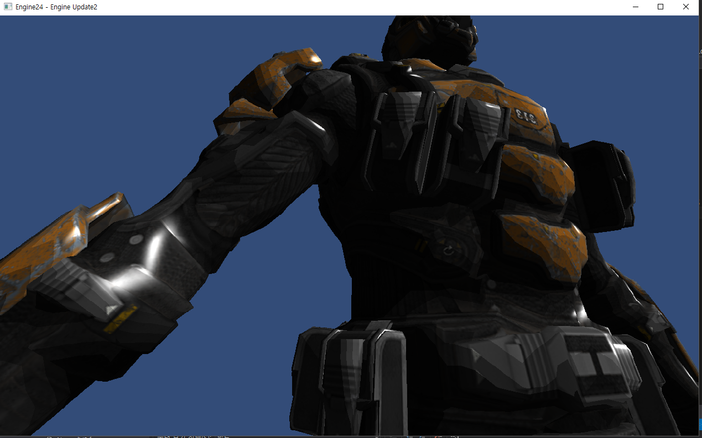

# DirectX
3D 물체 구현 
개발 환경 : DirectX 11, Visual Studio 2014 

## 구현
- 카메라 이동
- FPX 모델 로드
- 모델 

파이프라인을 따라 단계적으로 작업하고 중간과정에 값을 수정해주어 다양한 랜더링이 가능했습니다. 
그래픽스 파이프라인을 처음 시작했을 때 다양한 설정 값으로 기반을 다지는 것이 굉장히 어려웠지만 
마이크로소프트 문서에서 모든 설정 값을 찾아서 필요하면 갖다가 사용하면 되는 것이기 때문에 
파이프라인만 이해한다면 순조롭게 작업을 할 수 있었습니다. DirectX를 사용하면서 Unreal Engine이나 Unity 엔진이 
얼마나 게임을 만드는데 편히를 주는지 알 수 있었습니다.
